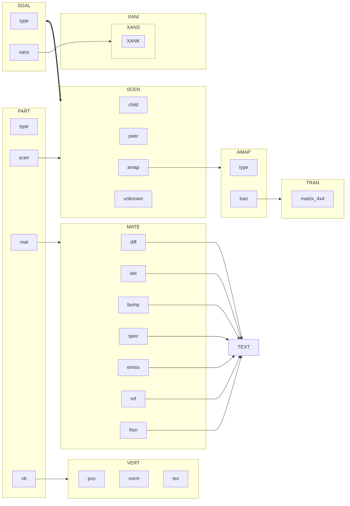

# mdl2gltf
FSX MDL to GLTF model converter

```mermaid

flowchart LR

subgraph SCEN
child
peer 
amap
unknown
end

amap --> AMAP

subgraph AMAP
type
tran
end

tran --> TRAN

subgraph TRAN
matrix_4x4
end


subgraph SGAL
sgal_type[type]
sgal_xans[xans]
end

SGAL <==> SCEN

sgal_xans --> XANS


subgraph XANI

subgraph XANS

subgraph XANK

end

end

end

subgraph PART
part_type[type]
part_scen[scen]
part_mat[mat]
part_vb[vb]
end

part_scen --> SCEN
part_vb --> VERT

subgraph VERT
vert_pos[pos]
vert_norm[norm]
vert_tex[tex]
end


subgraph MATE
mat_diff[diff]
mat_det[det]
mat_bump[bump]
mat_spec[spec]
mat_emiss[emiss]
mat_ref[ref]
mat_fren[fren]
end

part_mat --> MATE

mat_diff --> TEXT
mat_det --> TEXT
mat_bump --> TEXT
mat_spec --> TEXT
mat_emiss --> TEXT
mat_ref --> TEXT
mat_fren --> TEXT


```